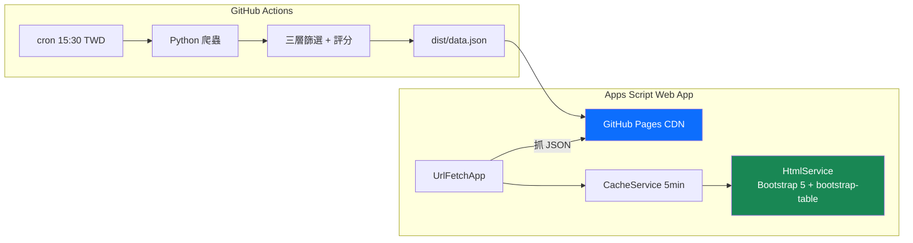

# 📈 Stock Radar — 台股每日籌碼掃描

每日台股收盤後，自動篩選「**籌碼進駐 + 低基期 + 基本面正向**」的候選股，
輸出 JSON 至 GitHub Pages，透過 Apps Script Web App 瀏覽。

> 作者：LLLeo · 版本：v2.0
> 詳細規格請見 [SPEC.md](./SPEC.md) · 部署指南請見 [DEPLOY.md](./DEPLOY.md)

---

## 架構圖



### 資料流

```
TWSE T86 API ──→ 籌碼面初篩 ──→ HiStock + Goodinfo/FinMind
                                    │
                                    ▼
                          技術面 + 基本面篩選評分
                                    │
                                    ▼
                          dist/data.json（GitHub Pages）
                                    │
                                    ▼
                          Apps Script Web App（前端）
```

---

## ✨ 功能特色

- **籌碼面初篩**：投信 / 主力（三大法人）買超門檻 + 連續買超天數
- **技術面過濾**：排除已大漲、留下均線糾結未發動的標的
- **基本面驗證**：月營收年增 OR 季 EPS 為正，排除虧損股
- **JSON 輸出**：攤平結構，前端可直接消費
- **GitHub Pages**：JSON 公開託管，免維護伺服器
- **Apps Script Web App**：表格排序 / 搜尋 / 分頁，支援近 7 天歷史切換
- **GitHub Actions 排程**：每個交易日 15:30 (UTC+8) 自動執行

---

## 🛠 技術棧

| 類別 | 工具 |
|------|------|
| 語言 | Python 3.11+ |
| 爬蟲 | `requests`, `lxml`, `fake-useragent` |
| 資料處理 | `pandas`, `numpy` |
| 排程 | GitHub Actions (cron) |
| 前端託管 | GitHub Pages |
| 前端框架 | Apps Script + Bootstrap 5 + bootstrap-table + SweetAlert2 |
| 重試機制 | `tenacity` |

---

## 📂 專案結構

```
stock-radar/
├── README.md
├── DEPLOY.md                    # 一步步部署指南
├── SPEC.md                      # 詳細規格
├── requirements.txt
├── .env.example
├── .github/workflows/
│   ├── scrape.yml               # 主排程：爬蟲 + JSON + GitHub Pages
│   └── daily_scan.yml           # 舊版排程（保留參考）
├── config/
│   └── filters.yaml             # 篩選條件參數化
├── src/
│   ├── main.py                  # 主流程（--output 輸出 JSON）
│   ├── scrapers/                # 各來源爬蟲
│   ├── filters/                 # 三層篩選邏輯
│   ├── notifiers/               # （保留，主流程不再呼叫）
│   └── utils/                   # logger / 交易日判斷 / retry
├── dist/                        # GitHub Pages 公開目錄
│   ├── data.json                # 最新掃描結果
│   ├── dates.json               # 可用日期清單
│   └── history/                 # 每日快照（最多 7 天）
├── apps-script/                 # Apps Script Web App 範例
│   ├── Code.gs
│   ├── Index.html
│   └── README.md
└── tests/
```

---

## 🚀 安裝與快速開始

### 1. Clone 專案

```bash
git clone https://github.com/<你的帳號>/stock-radar.git
cd stock-radar
```

### 2. 建立虛擬環境並安裝套件

```bash
python3 -m venv .venv
source .venv/bin/activate          # Windows: .venv\Scripts\activate
pip install -r requirements.txt
```

### 3. 本地執行

```bash
python -m src.main                          # 真實流程，抓今日資料
python -m src.main --date 20260424          # 指定日期
python -m src.main --mock                   # 用內建 mock 資料，不打外網
python -m src.main --use-finmind            # 改用 FinMind 取代 Goodinfo
python -m src.main --output dist/data.json  # 指定 JSON 輸出路徑
```

預設輸出至 `dist/data.json`。

---

## 🔐 部署指引

完整部署步驟請見 **[DEPLOY.md](./DEPLOY.md)**。

快速摘要：
1. **GitHub repo 設定**：啟用 GitHub Pages（source: GitHub Actions）
2. **GitHub Secrets**：只需設定 `FINMIND_TOKEN`（選用）
3. **Apps Script**：貼入 `apps-script/` 的 Code.gs + Index.html，修改 BASE_URL，部署為 Web App
4. **測試**：手動觸發 workflow（勾 mock），確認 GitHub Pages 有 `data.json`

---

## ⏰ 排程說明

- 預設於台北時間 **每週一至週五 15:30** 執行（收盤後資料已公佈）
- GitHub Actions 使用 UTC，對應 cron：`30 7 * * 1-5`
- 國定假日由 `src/utils/trading_calendar.py` 判斷自動跳過
- 也可手動觸發（`workflow_dispatch`）

---

## 🧪 開發

```bash
# 測試
pytest tests/

# 格式化
black src/ tests/
flake8 src/ tests/
mypy src/
```

---

## ❓ 常見問題

### Q: Goodinfo 被擋怎麼辦？
切換到 FinMind API：`python -m src.main --use-finmind`

### Q: GitHub Actions 沒在排程時間執行？
GitHub cron 不保證準時（可能延遲 5-30 分鐘），且 repo 連續 60 天無 commit 會自動停用 schedule。

### Q: JSON 更新了但 Web App 還是舊資料？
GitHub Pages CDN 有 ~10 分鐘快取；Apps Script 端 CacheService 也有 5 分鐘快取。最多等 15 分鐘。

---

## ⚠️ 免責聲明

本專案僅供學習與個人研究使用，**不構成任何投資建議**。
投資有賴自行判斷，風險自負。

---

## 📜 授權

MIT License
